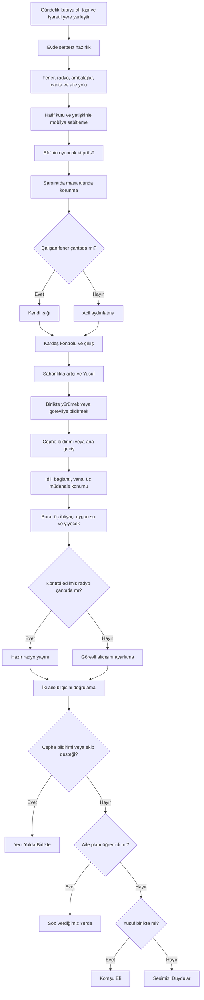

# Fiziksel maceranın karar haritası

Aktif akış, Assets/YanYana/Editor altındaki Physical, PreparationActivities, PackingPuzzle, HomeQuake ve Evacuation yazarlarının sahneye yerleştirdiği native Visual Scripting grafikleridir. Content/Campaign.json önceki prototipin verisini taşır; fiziksel sürüm yalnız ortak bayrak adlarını buradan alır. JSON'daki 124 adım aktif oyun zinciri değildir.

| Durum | Gerçek karşılık |
|---|---|
| FamilyPlan, MapCell | Ardışık açık karelerden aile ağacına ulaşmak |
| FlashlightReady, FSlot*, FCoverOpen, FSwitch | Pil yönleri, kapak ve anahtar |
| Found.*, Pack.*, BagCell*, BagClosed | Odadan toplama, döndürme, hücre doluluğu, çantayı kapatma |
| BagZipStep, BagStrapLeft/Right, BagStrapPos*, BagCarryStep, BagCarried, BagReady | Fermuar boyunca ilerleme, ayrı askı ayarları ve kapıya gerçek yürüyüş; kapatmak tek başına taşıma denemesini tamamlamaz |
| SupplyChoiceWater/Food, SupplyViewedWater/Food, WaterReady, FoodReady | Ambalajları çevirme; tarih ve açıklığı karşılaştırıp kullanılabilir veya uygun olmayan malzeme seçme |
| ReliefWaterGiven, ReliefFoodGiven | İki bağımsız teslim; uygun hazırlanmış malzeme çantadan, diğer durumda yardım masasından |
| RadioReady, RadioDial | Hazırlıkta yayın frekansını bulmak |
| ShelfSecured, WardrobeSecured | Derya'nın yürüyerek sırayla tamamladığı iki iş |
| ExitBoxMoved, ExitCleared | Hafif kutuyu yol dışına taşımak |
| CoverStage, Protected | Yakında çökme, eli başın üzerine taşıma, diğer eli masa ayağına götürme |
| SiblingChecked, LightFound, ExitOpened | Sarsıntıdan sonra birlikte çıkabilme koşulları |
| AftershockDone | Sahanlıkta durup yeniden korunma |
| NeighborAsked, NeighborBoxClear, NeighborTogether | Sorulan destek türü, hafif engel ve Yusuf'un yürüyüşü |
| HoseConnected, HoseReady, FireStage, FireCompleted | Bağlantı, vana ve üç yangın grubu |
| FacadeReported, FireAssisted | Alternatif alana öncelikli yönlendirme |
| VisitorHelped*, ReliefGiven | Yardım masaları ve çantadan/masadan su |
| BroadcastSource, BroadcastDial, BroadcastHeard | Hazır radyo veya görevli alıcısıyla resmî bilgi |
| EvidenceOpen, IdentityPeople, IdentityMarker, InfoVerified | Aile kartını/kaydını açıp iki görseli eşleştirme |
| Ending, FinalStep, Reunited | Öncelikli final seçimi; yol işareti, aileye yürüyüş, Efe'nin yanına gelmesi ve aile işareti; her aşamaya ayrı kamera ve varışta otomatik kayıt |

Finaller toplam puanla seçilmez. Fener ve radyonun hazırlanmış olması yanında çantaya yerleştirilmiş ve çantanın kapanmış olması kontrol edilir. Aynı taşıma kuralı su, yiyecek, aile kartı ve rahatlatıcı oyuncak için geçerlidir. Açık çantada bırakılan malzeme sonraki bölümde kendiliğinden oyuncunun yanında belirmez; acil ışık ve yardım masası gibi alternatifler kullanılabilir.

Kayıtlar yalnız Deprem.YanYana.v1.* anahtarlarını kullanır. Tamamlanan eylemler, yerleşimler, roller ve aktör konumları saklanır. Yarım sürükleme duraklatmada geçerli konuma döner. Tekrarda seçilen giriş görüntüsü yüklenir; daha sonra alınmış anların geçerliliği temizlenir. Karar listesi ziyaret edilmiş girişleri açar. Mini oyun profil adı Deprem.YanYana.v1.activities.json olarak ayrıdır.

Tekrar menüsünde on giriş bulunur: aile planı, fener, radyo, su, yiyecek, çanta taşıma, ev hazırlığı, tahliye, yangın ve yardım noktası. Su/yiyecek/çanta girişleri ilk açıldıkları sıraya göre kaydedilir. Önceki bir seçime dönmek, sadece ondan sonra açılmış girişleri geçersiz kılar.

İlk gündelik kutu alma, taşıma, yol seçme ve işaretli yere yerleştirme zinciri uygulanmıştır. Kardeşin dinlenmesi, rahatlatıcı eşya ve öğrenilen aile işaretine katkısı sonraki bölümlerde görünür karşılık bulur. Bütün dalların aynı içerik derinliğine ulaştığı veya çocuklarda 30 dakika sürdüğü varsayılmaz. Eski prototip verisinde yazanlar tamamlanmış kabul edilmez. Gerçek ilk oynayış için `FIRST_PLAY_PROTOCOL.md` ve boş gözlem formu kullanılır.
